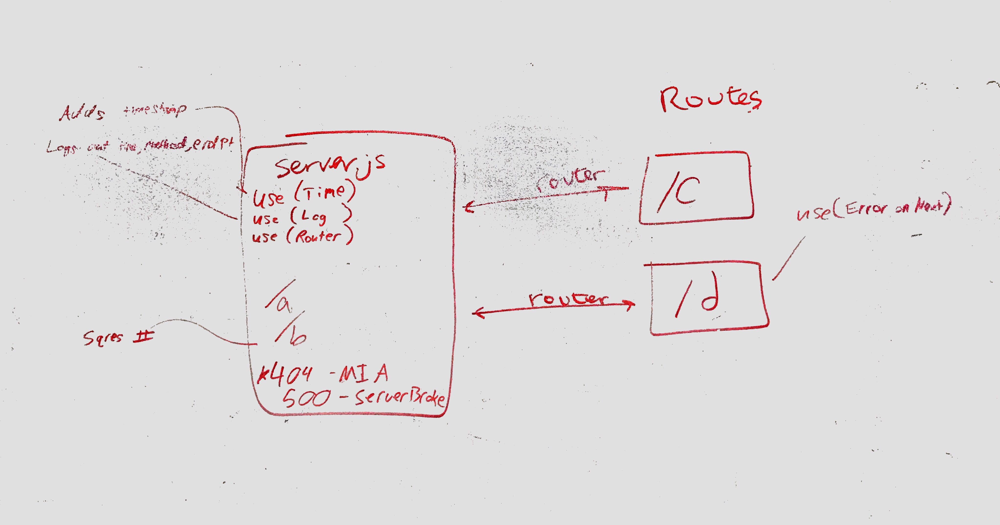

# LAB: 07

## LAB: API Server

### Author: Adrienne Easton

### Links and Resources
* [submission PR]()
* [travis]

### Modules
#### `post`
##### Exported Values and Methods

#### `post`
##### Exported Values and Methods

#### `put`
##### Exported Values and Methods

#### `delete`
##### Exported Values and Methods

### Setup
* To install necessary dependancies type 'npm i'
  
#### Tests
* To run test type 'npm test'.

